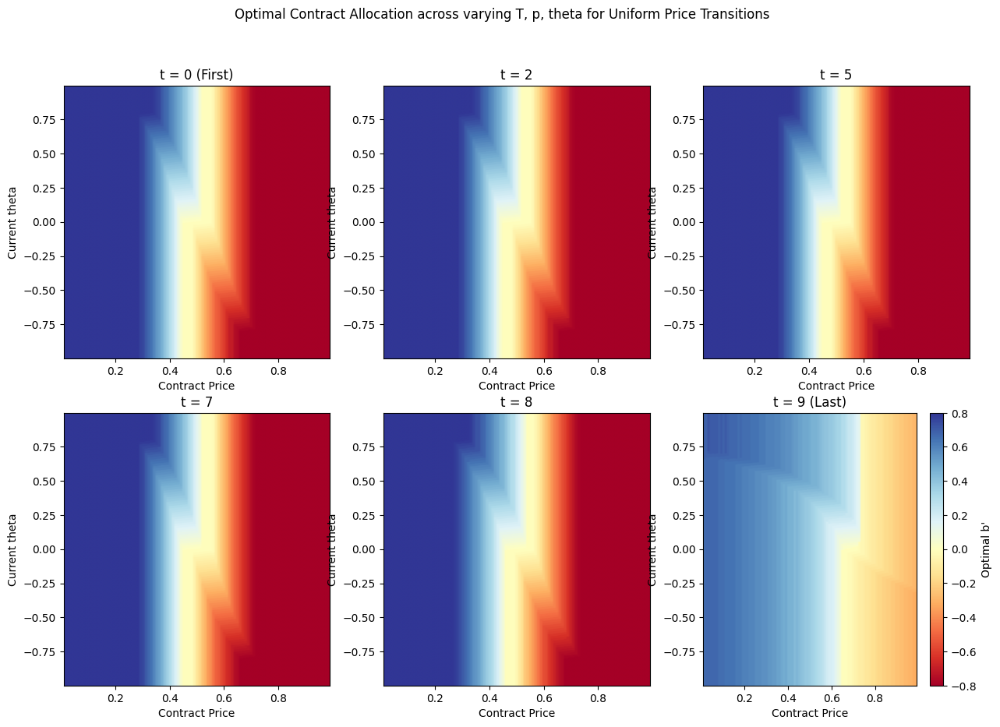
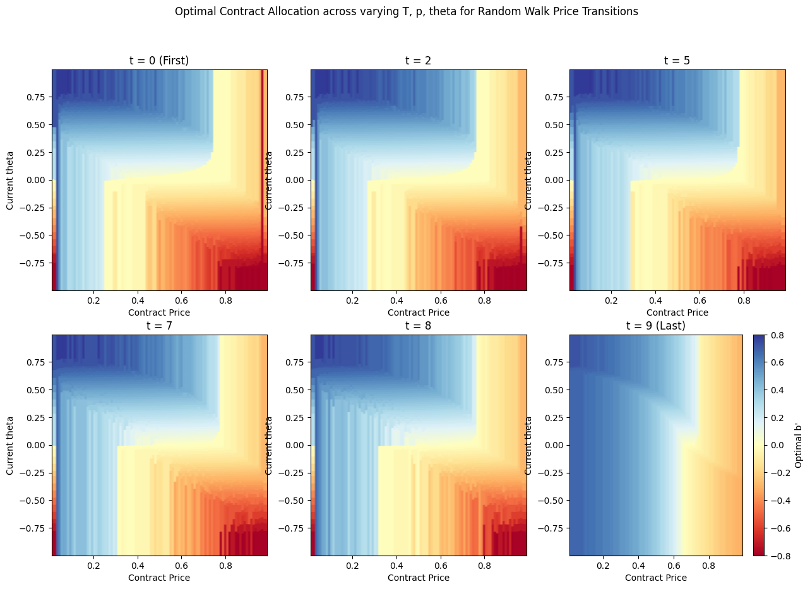
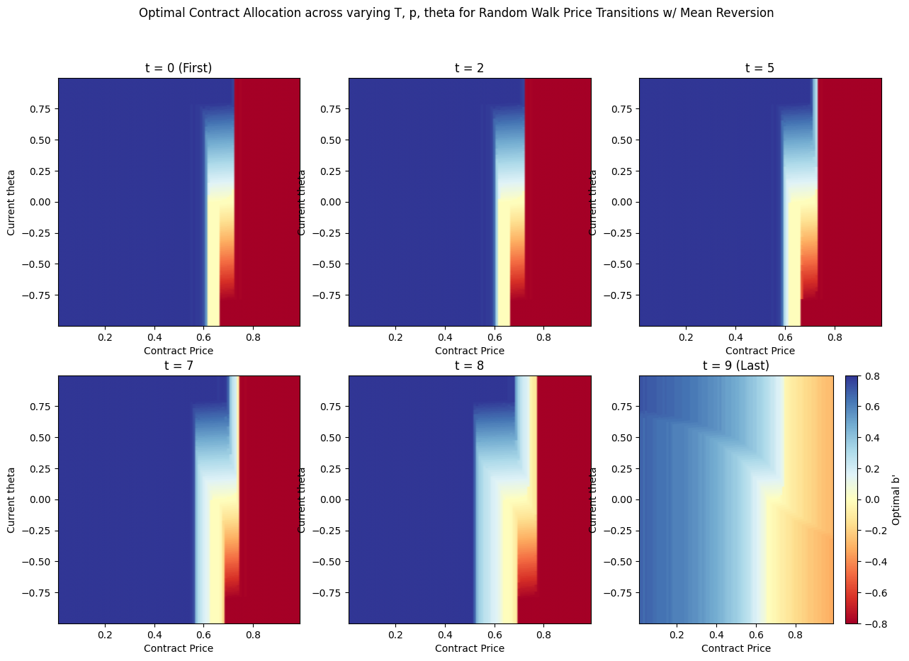
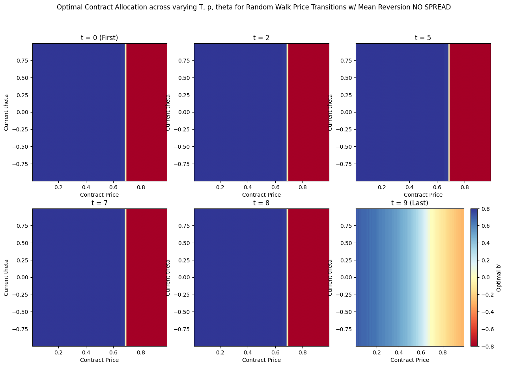

# Prediction Market Trading Algorithms

## The Challenge: State Space Explosion
A direct Dynamic Programming formulation tracking absolute wealth `W_t` and contract counts `x_t` leads to an **unbounded state space**:
- Wealth `W_t` can grow without bound
- Contract counts `x_t` can be arbitrarily large
- Result: DP table size `O(T × |W| × |x|)` with `|W|, |x| → ∞` → **computationally infeasible**

## Key Innovation: Proportional Allocation

We show that for log utility with multiplicative returns, optimal trading depends only on the **proportion** of wealth allocated to contracts, not on absolute wealth levels. Defining:

`θ_t = (x_t × c_t) / (W_t + x_t × c_t) ∈ [-1, 1]`

where:
- `θ > 0`: Net long YES contracts
- `θ < 0`: Net long NO contracts  
- `|θ|`: Fraction of portfolio value in contracts

reduces the state space from unbounded `(W, x, c)` to bounded `(θ, c)` while yielding the same optimal policy as the unbounded formulation. This is true **even in the case of asymmetric spreads for YES and NO contracts**.

## Solution: Bounded Dynamic Programming
- **Policy Matrix**: `(T, θ, c)` where θ ∈ [-1,1]
- **Space Complexity**: $O(T*N^2)$ vs previous $O(T * \infty)$
- **Time Complexity**: $O(T * N^3)$
- **Realism**: Includes asymmetric spreads

## Evaluation & Results
We evaluate on 453 real [Polymarket price paths](https://www.kaggle.com/datasets/sandeepkumarfromin/full-market-data-from-polymarket) with 5% buy / 10% sell spreads (for YES and NO contracts, though they can be different in practice)

### Strategy Robustness:
- **Uniform regime**
- **Random walk**
- **Mean reverting**

### Key Finding:
Optimal allocation & performance depends on:
- Outcome probability estimates
- Regime identification
- Buy Spread / Sell Spread

## Implications
- **Traders**: Optimal position sizing with real market spreads
- **Platforms**: Better AMM design using bounded inventory $\theta$
- **Research**: Tractable DP for prediction market equilibrium, future work on trader-market maker interactions, insider identification

## Repository Structure
- `trading_dp.ipynb` - DP implementation with three regimes & policy analysis
- `evaluation.ipynb` - Evaluation on Polymarket data
- `trading_dp.py` - Source code for DP functions
- `docs/FORMULATION.md` - DP derivation & runtime analysis
- `docs/EVALUATION.md` - Evaluation methods overview
- `data/` - Polymarket price paths

## Quick Start
```python
from trading_dp import make_transition_matrix, get_theta_bounds, TradingDP

# Make Transition Matrix 
regime_trans = make_transition_matrix(fair_value=p_subj, volatility = 1, mean_reversion = 0.5, n_prices=N_PRICES)

# Initialize TradingDP
trading_dp = TradingDP(n_prices=N_PRICES, 
                       n_b_tick=N_B_TICK, 
                       n_theta=N_THETA, 
                       C_MIN=C_MIN, 
                       C_MAX=C_MAX,
                       B_TICK_MIN=B_TICK_MIN, 
                       B_TICK_MAX=B_TICK_MAX, 
                       THETA_MIN=THETA_MIN, 
                       THETA_MAX=THETA_MAX)

# Create DP Policy
V, policy = trading_dp.run_dp(regime_trans, 
                                p_subj, 
                                gamma_yes_b=GAMMA_YES_B,
                                gamma_yes_s=GAMMA_YES_S,
                                gamma_no_b=GAMMA_NO_B,
                                gamma_no_s=GAMMA_NO_S,
                                T=T_MAX)

# Backtest results
results = trading_dp.simulate_trading(policy, 
                                      polymarket_paths, 
                                      T_MAX = T,
                                      gamma_yes_b=.05,
                                      gamma_yes_s=.10,
                                      gamma_no_b=.05,
                                      gamma_no_s=.10,
                                      debug=False, 
                                      n_jobs=-1)
results
```

## Visualizations






